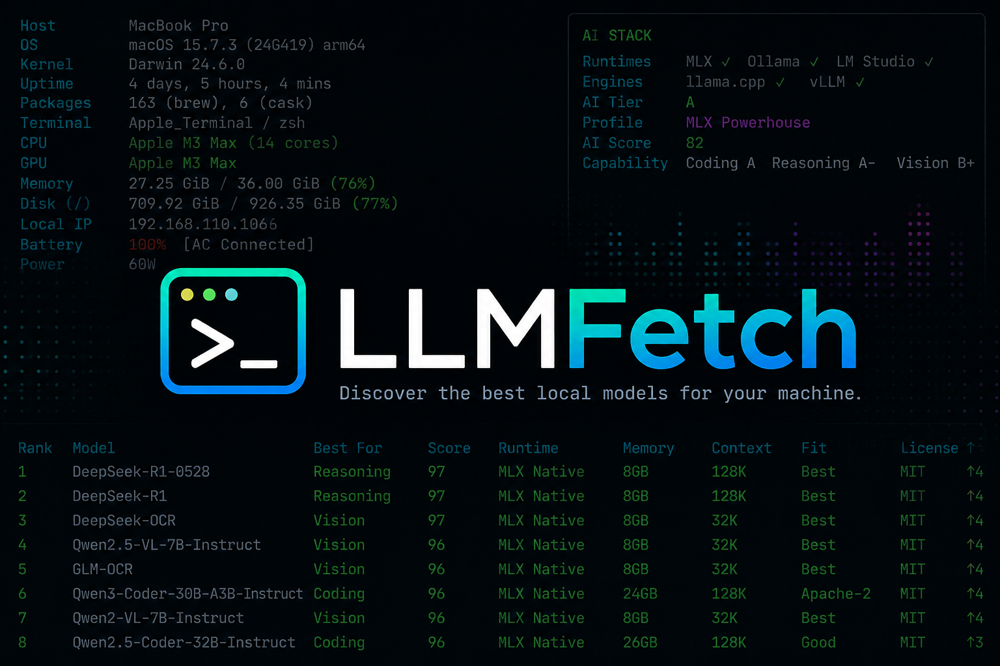
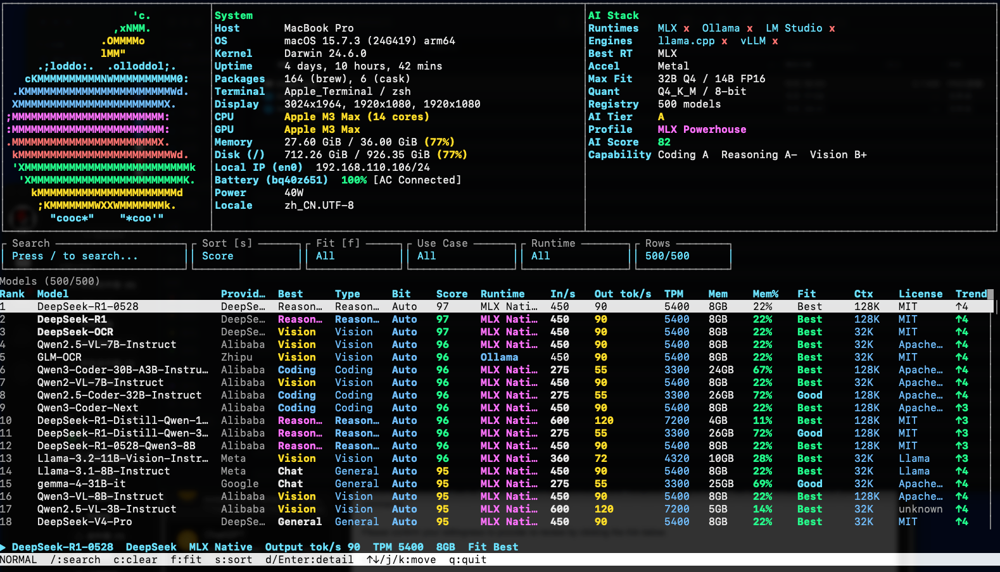

<div align="center">



# LLMFetch

**本地大模型工作站仪表盘，帮你发现最适合当前机器的模型。**

[English](README_EN.md) · [下载 Release](https://github.com/T-Zevin/llmfetch/releases/latest) · [更新日志](CHANGELOG.md)


</div>

## 目录

- [项目介绍](#项目介绍)
- [截图](#截图)
- [快速安装](#快速安装)
- [使用方式](#使用方式)
- [交互快捷键](#交互快捷键)
- [功能亮点](#功能亮点)
- [模型注册表](#模型注册表)
- [Logo 确认](#logo-确认)
- [本地开发](#本地开发)
- [路线图](#路线图)

## 项目介绍

LLMFetch 是一个面向本地 LLM 用户的终端工具。它一部分像 `fastfetch`，展示你的系统、芯片、内存、屏幕、电池、运行环境；另一部分像轻量版 `htop`，让你在终端里搜索、排序、筛选模型排行榜。

目标很直接：打开终端，立刻知道这台机器适合跑什么模型、用什么 runtime、需要多少内存、速度大概多少。

## 截图

<div align="center">
  
</div>

## 快速安装

前往最新 Release 下载对应平台的压缩包：

[https://github.com/T-Zevin/llmfetch/releases/latest](https://github.com/T-Zevin/llmfetch/releases/latest)

Apple Silicon Mac:

```bash
curl -L -o llmfetch.tar.gz \
  https://github.com/T-Zevin/llmfetch/releases/download/v0.3.0/llmfetch-0.3.0-aarch64-apple-darwin.tar.gz
tar -xzf llmfetch.tar.gz
cd llmfetch-0.3.0-aarch64-apple-darwin
./llmfetch
```

macOS 如果提示未验证开发者，可以执行：

```bash
xattr -dr com.apple.quarantine ./llmfetch
```

## 使用方式

```bash
# 默认进入交互界面
llmfetch

# 快照模式，类似 fastfetch
llmfetch --snapshot

# 输出 JSON，方便脚本或前端读取
llmfetch --json

# 查看候选 OS / Linux 发行版 logo
llmfetch --logos
```

参数说明：

| 参数 | 说明 |
| --- | --- |
| `llmfetch` | 默认打开交互式模型浏览器 |
| `-i`, `--interactive` | 显式打开交互式模型浏览器 |
| `-s`, `--snapshot` | 输出一次性系统和模型快照 |
| `--json` | 输出 JSON 数据 |
| `--logos` | 打印候选 OS / Linux 发行版 logo |
| `--ascii` | 禁用 Unicode 边框和 emoji |
| `--no-color` | 禁用 ANSI 颜色 |
| `--no-emoji` | 禁用 emoji，保留 Unicode 边框 |
| `--help` | 查看帮助 |

## 交互快捷键

| 按键 | 功能 |
| --- | --- |
| `/` | 进入搜索 |
| `Esc` / `Enter` | 退出搜索 |
| `Ctrl+U` | 清空搜索输入 |
| `c` | 清空搜索 |
| `s` | 切换排序：Score、Out tok/s、Memory、Context、Fit、Trend |
| `f` | 切换适配筛选：All、Best、Good、Near |
| `↑/↓` 或 `j/k` | 移动选中行 |
| `d` / `Enter` | 展开或收起模型详情 |
| `q` | 退出 |

## 功能亮点

- 系统识别：macOS、Apple Silicon、内存、磁盘、屏幕、电池、网络、终端环境。
- AI Stack：检测 MLX、Ollama、LM Studio、llama.cpp、vLLM 等本地运行环境。
- 模型排行榜：按综合分、速度、内存、上下文、适配度、许可证等指标排序。
- 交互浏览：支持搜索、筛选、排序、选择、详情展开。
- 长模型名滚动：选中行自动水平滚动长模型名。
- 彩色终端 UI：重点列高亮，同时支持无颜色、ASCII、无 emoji 模式。
- 多平台发布：macOS、Linux、Windows，支持 arm64 和 x86_64。

## 模型注册表

内置模型数据位于：

```text
registry/models.json
internal/registry/models.json
```

刷新模型：

```bash
python3 scripts/collect_models.py --target 5000
make build
```

当前采集脚本使用 Hugging Face public API 做发现和归一化。长期目标是做一个“自动采集 + 人工校准”的本地模型 registry，而不是每次运行都依赖实时 API。

## Logo 确认

预览 LLMFetch 内置候选 logo：

```bash
./bin/llmfetch --logos
```

如果本机安装了 fastfetch / neofetch，可以对照确认 Linux 发行版风格：

```bash
fastfetch --list-logos
fastfetch --print-logos | less -R
neofetch -L --ascii_distro Ubuntu
```

后续 Linux 自动识别会优先读取 `/etc/os-release`：

```text
ID=ubuntu
ID_LIKE=debian
NAME="Ubuntu"
PRETTY_NAME="Ubuntu 24.04.2 LTS"
```

## 本地开发

```bash
git clone git@github.com:T-Zevin/llmfetch.git
cd llmfetch
go test ./...
make build
./bin/llmfetch
```

生成本地 macOS 包：

```bash
make build
mkdir -p dist
tar -C bin -czf dist/llmfetch-<version>-aarch64-apple-darwin.tar.gz llmfetch
shasum -a 256 dist/llmfetch-<version>-aarch64-apple-darwin.tar.gz
```

## 路线图

- Linux 发行版 logo 与 `/etc/os-release` 自动映射
- 更完整的模型来源、license、quant、backend 可信度校准
- `--limit`、`--sort`、`--filter`、`--provider` 等 CLI 参数
- benchmark / live-bench 模块
- Homebrew Tap 与一行安装脚本

## License

MIT
